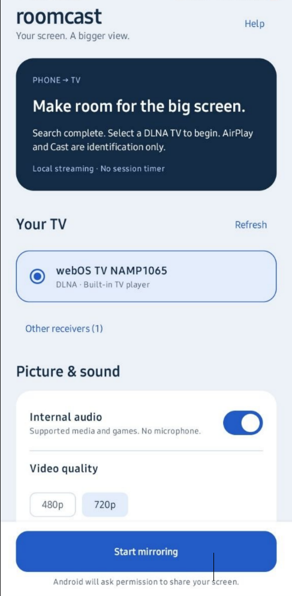
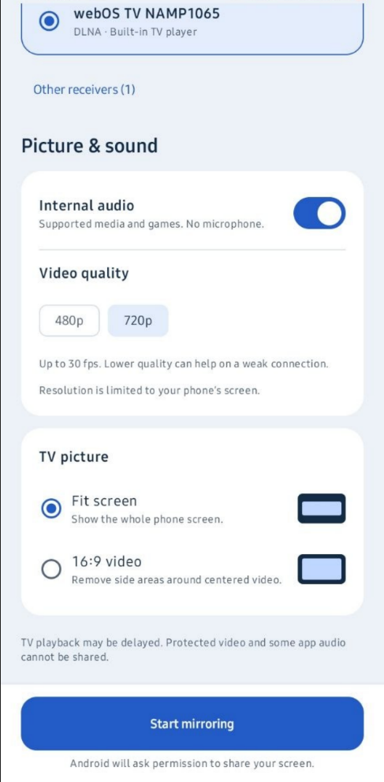

# Roomcast

### No Smart View? Bring your Android screen to your TV.

Roomcast mirrors your Android screen and supported internal audio to compatible DLNA TVs—an alternative for phones without built-in Smart View or screen mirroring. No TV browser, extra TV app, or session timer. Requires Android 10 or newer.

**Desktop coming soon.** Desktop screen mirroring is planned; the current desktop app provides a shared UI preview only. Capture and streaming are currently Android-only.

## Screenshots

<p>
  
  
</p>

## TV compatibility

Well compatable with a **webOS TV**.

**Android TV** may also work if it provides a compatible DLNA receiver, built-in Chromecast alone is not enough.

**Experimental:** compatibility and playback smoothness vary. The TV must accept a live, close-delimited HTTP MPEG-TS stream containing H.264 video and AAC audio through DLNA/UPnP AVTransport. Some TVs support file playback through DLNA but reject this live format. Finding a TV does not prove it can play the stream.

| Connection | Implemented |
| --- | --- |
| DLNA / UPnP | Discovery, native-player commands, live screen and optional internal audio |
| AirPlay | Discovery / identification only |
| Google Cast | Discovery / identification only |
| Miracast / Wi-Fi Direct | No sender implementation |

No TV browser, custom TV application, cloud service, account, or mirroring-duration paywall is used. The TV decides whether to show its native approval popup; the app cannot force one. DLNA playback can have several seconds of latency.

## Full-screen 16:9 video

Before starting a session, choose **TV picture → 16:9 video** when your player shows a centered 16:9 picture with black side bars on the landscape phone screen. Roomcast removes those side areas and fits the remaining video to the TV without stretching it. Keep the player in Fit / Original aspect-ratio mode.

This is a fixed centered crop, **not automatic black-bar detection**: it can cut off real content or controls if your player uses a different layout. Portrait remains fitted. Choose **Fit screen** (the default) for ordinary screen sharing. Stop mirroring before changing modes.

## Build and install

Open this project in Android Studio with the SDK and JDK required by its existing Gradle configuration, or run:

```sh
./gradlew :androidApp:assembleDebug
adb install -r androidApp/build/outputs/apk/debug/androidApp-debug.apk
```

The debug APK is in `androidApp/build/outputs/apk/debug/`. Minimum SDK is 29; the existing compile/target SDK is 37. Android 17+ receives a local-network runtime permission request before discovery. Android 13 does not need that permission.

## Use with the phone and TV

1. Connect both devices to the same Wi-Fi network. Alternatively, enable the phone hotspot and connect the TV to it. Internet access is not required, but the devices must be able to communicate locally.
2. Enable media sharing / DLNA in the TV settings if available. Keep the TV on.
3. Open **Roomcast → Find TVs**. Select a receiver labelled **DLNA**. An AirPlay-only or Cast-only result cannot be used by this version.
4. Choose video quality and whether to include internal audio. Only resolutions supported by the phone's screen dimensions are offered (480p / 720p on the tested A12; up to 1080p on higher-resolution phones). Choose Fit screen for general mirroring or 16:9 video for centered landscape video with side borders.
5. Tap **Start mirroring**, allow audio permission if requested, and approve Android screen sharing. Allow notifications to get a convenient Stop control outside the app; denial does not prevent mirroring. Approve any prompt the TV itself presents.
6. Open the content you want to share. Use **Stop mirroring**, the ongoing notification's **Stop** action, or Android's screen-sharing control to end the session.

Capture continues when the app is in the background. Removing the app from recents ends capture. A stopped process does not automatically resume capture. The TV receives a fixed 16:9 landscape video. The captured content resizes as the phone rotates, preserving its aspect ratio; portrait content has side bars, and ultrawide phone content can have top/bottom bars. The TV does not need to restart its decoder on rotation.

## Version highlights

- **0.4.3:** Refreshed UI, persistent Start/Stop controls, and screen-aware quality options.
- **0.4.2:** Optional 16:9 video mode removes side areas around centered landscape video.
- **0.4.1:** Less capture-loop overhead and batched stream packets; substantially smoother playback reported on the tested A12.
- **0.4:** Separate rendering worker, steadier frame timing, and a 1.5-second presentation buffer.
- **0.3:** Automatic rotation, up to 30 fps, and shared audio/video timing.
- **0.2:** Longer TV command timeouts; streaming continues after a late Play acknowledgement when data is still flowing.

## Troubleshooting and limits

Playback smoothness and audio/video sync still depend on the phone, network, and TV; 50/60 fps is not supported. Session details show frame timing and send-queue statistics. Longest times are session maxima, and a small queue does not prove smooth TV playback. For persistent pauses, share these details and note whether phone video and TV audio continued.

- **No TV found:** verify the TV is connected to the phone hotspot or same LAN, enable TV media sharing, disable VPN routing if it interferes, and check network client-isolation settings. The app sends SSDP on each active IPv4 interface, including tethering interfaces; firmware may still block hotspot multicast discovery.
- **Only AirPlay or Cast appears:** this identifies a likely receiver protocol; those sender protocols still need implementation. It does not establish which protocol PigeonCast used.
- **TV rejects Play / never loads:** live MPEG-TS may be unsupported even when ordinary DLNA video files work. The app reports command failures and ends capture if the TV does not read the stream for 30 seconds. There is no duration limit while the TV keeps reading.
- **Streaming message but no picture:** that message means the TV requested the HTTP stream, not that it decoded or displayed it. Check native-player format support.
- **Silent audio:** only permitted media/game/unknown-usage playback is captured. Individual apps can prohibit capture; calls, communication audio, and protected content are not supported. Microphone recording is not used.
- **Black video:** protected/secure windows cannot be mirrored through MediaProjection.
- **Lag or thermal throttling:** try 480p. DLNA buffering is controlled in part by the TV; this transport is unsuitable for latency-sensitive gaming.

The native popup wording, PigeonCast receiver label, exact TV model/firmware, and results on the A12 hotspot are the next useful evidence for choosing an additional transport. Do not include pairing PINs when sharing screenshots.

## Implementation

Traffic uses unencrypted local HTTP. Use a trusted local network. There is no persistent screen recording or analytics.

## Verification

```sh
./gradlew :shared:jvmTest :shared:testAndroidHostTest :androidApp:lintDebug :androidApp:assembleDebug
```

Tests check TS packet boundaries, payload preservation, continuity counters, table CRCs, timestamps, AAC framing, XML parsing/DTD rejection, SOAP ordering/escaping, and HTTP session-path/keyframe behavior. These checks do not replace real MediaCodec, audio-policy, hotspot, or TV playback tests.

Android platform references: [MediaProjection](https://developer.android.com/media/grow/media-projection), [playback capture](https://developer.android.com/media/platform/av-capture), and [local network permission](https://developer.android.com/privacy-and-security/local-network-permission).
